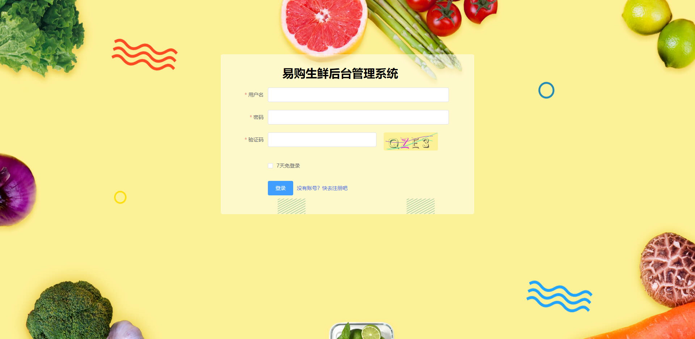
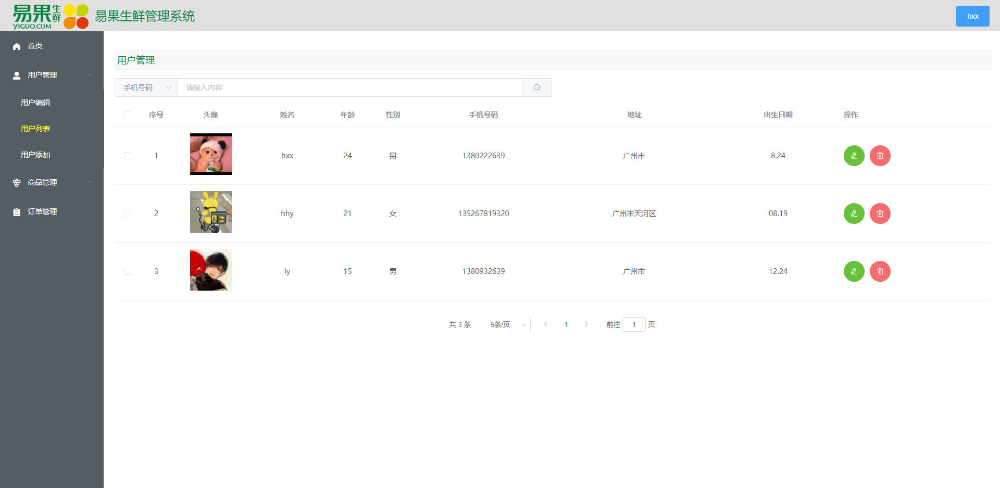
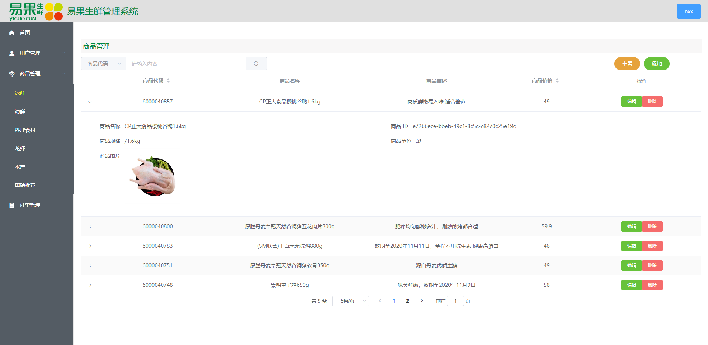
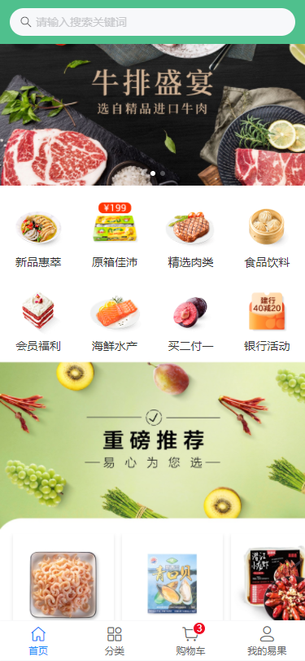
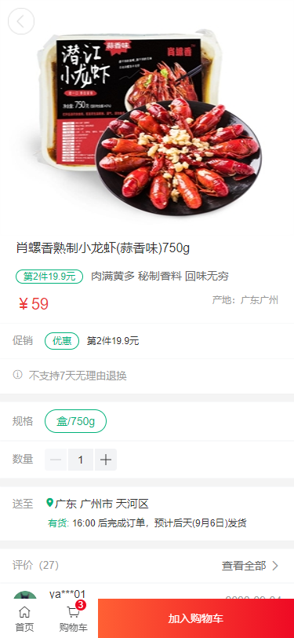
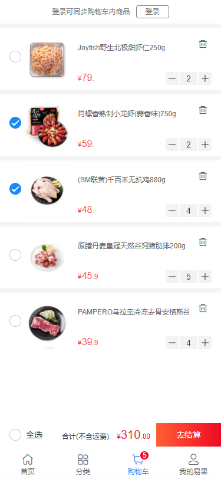
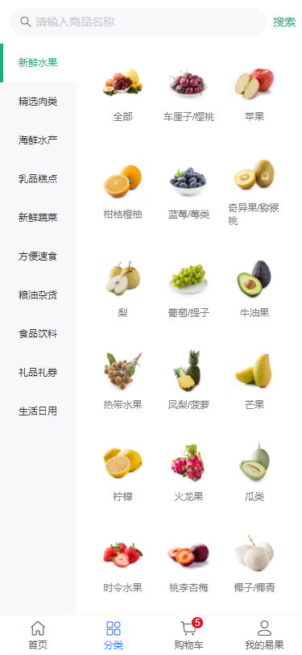

# 项目名称：易果生鲜

## 演示
    + 官网: http://www.yiguo.com/
    + 上线网址
        - 后台管理系统：http://120.24.62.247:2005/
        -   账号：test   密码：123456
        - webApp：http://120.24.62.247:2004/

## git仓库地址: 
    https://github.com/gzh52003/yiguo

## 团队与分工
    + 组长：黄晓勋，组员：胡慧颖，刘耀
    + 负责模块说明
        - 黄晓勋
            编写接口，协调工作
            后台管理系统：商品管理模块，路由配置，环境依赖
            webapp：商品详情页，购物车模块，登录功能，全局配置
        - 胡慧颖
            后台管理系统：登陆、注册、用户管理(用户编辑，用户列表，用户添加)模块;
            webapp："我的易果"、登录模块
        - 刘耀
            爬取数据
            后台管理系统：基本框架搭建、首页、订单管理
            webapp：首页、分类页

## 项目目录说明
    + 后台管理系统：

        ├─public        网站根目录
        │  └─image      图片
        ├─server        服务器
        └─src
            ├─api           封装请求api
            ├─assets        静态资源 
            ├─components    组件
            ├─pages         页面
            │  ├─goods      商品管理页
            │  ├─home       首页
            │  ├─login      登录
            │  ├─reg        注册
            │  └─user       用户管理
            ├─router        路由配置
            └─utils         工具包

    + webapp：
         ├─public   网站根目录
         │  └─img   图片
         ├─server   服务器
         └─src
             ├─assets       静态资源           
             ├─components   组件
             ├─router       路由配置
             ├─store        Vuex
             ├─utils        工具包
             └─views        页面
            
##  项目截图

***

***

***

***

***

***
